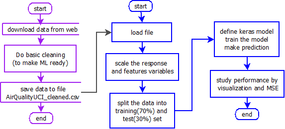

# Objective/Overview

The objective of this project is to use neural network with keras to solve regression problem in Python and R. This project was originally done in Python in _Deep Learning with Keras_, from Antonio Gulli and Sujit Pal, Keras regression example - predicting benzene levels in the air. Here we do this project in R.

This section executes blue part of the project flow shown in the figure below in R.
<p></p>



<p></p> 
* In previous section we downloaded the data from web and did some basic cleaning.
* In this section, we do the following
  - Load the data which was processed in previous section
  - Scale the variables (response and features)
  - Split the sample in 70-30 for training and testing
  - Define the model with one hidden layer and one output layer. The output layer has no activation function because it is regression problem.
  - Run the model and predict for testing
  - Meausre the performance with MSE and some visualization
  
## Links

Following are the links for the code and report generated

Relates to purple part of the project (see figure above).
  - [Report in R](mproj_keras_regression_airquality_1_basic.html) (This page!)
  - [Code as Rmd file](mproj_keras_regression_airquality_1_basic.Rmd) (executed in Rstudio)

Relates to blue part of the project (see figure above).
  - [Report in R](mproj_keras_regression_airquality_2_keras.html)
  - [Code as Rmd file](mproj_keras_regression_airquality_2_keras.Rmd) (executed in Rstudio)
  - [Report in Python](mproj_regression_airquality.html)
  - [Code in Python](mproj_regression_airquality.ipynb) (executed in Jupyter)

## Data source: 

Courtesy of https://archive.ics.uci.edu/ml/datasets/Air+Quality

# Read and Split the Data

The following reads the clean data processed in previous section.

```{r read the clean/ML Ready file}
df_data <- read.csv(file="c:/ds_local/dataset/AirQualityUCI_cleaned.csv", header=TRUE)
```

The following scales and splits the sample in 70-30 ratio
```{r r data preparation - scale and split}
trn <- df_data
trn <- scale(trn) 

set.seed(12345)
idx <- sample(seq(1, 2), size = nrow(trn), replace = TRUE, prob = c(70, 30))
table(idx)

y_trn <- trn[,4]
x_trn <- trn[,-4]
trn_tr <- trn[idx==1,]
trn_te <- trn[idx==2,]
x_trn_tr <- x_trn[idx == 1,]
x_trn_te <- x_trn[idx == 2,]
y_trn_tr <- y_trn[idx == 1]
y_trn_te <- y_trn[idx == 2]

```

# Defining the model

* Layer 1: Input layer = No of features = 12
* Layer 2: Hidden layer = 8 (data compression like PCA but non-linear)
* Layer 3: output layer = 1. No activation as response is regression.

```{r modelling and performance}

library(keras)

# ----------- defining the model ---------------------------------------------
#install_keras()
model <- keras_model_sequential() 
model %>% 
  layer_dense(units = 8, input_shape = 12, activation="relu",
              kernel_initializer="glorot_uniform") %>% 
#  layer_dense(units = 5, kernel_initializer="glorot_uniform") %>% 
#  layer_activat    ion('relu') %>% 
#  layer_dropout(rate = 0.4) %>% 
  layer_dense(units = 1, kernel_initializer="glorot_uniform") 
# ------- Compilation -  configure learning process ---------------------------
model %>% compile(
  loss="mse", 
  optimizer="adam"
)

summary(model)
history <- model %>% fit(x_trn_tr,y_trn_tr,  # x_trn_tr must be as.matrix
                         epochs=10, batch_size=4, validation_split=0.3)
plot(history)
```


```{r keras code for training}
#--- unsale andm test if it unscaled properly --
trn_unscaled <- 
  trn[,4]*attr(trn, 'scaled:scale')[4] + attr(trn, 'scaled:center')[4]
cat("test for scale-back-transformation", all.equal(df_data[,4],trn_unscaled),"\n")
head(data.frame(df_data[,4],trn_unscaled),6)
#--- predict the response, unscale and calculated mean squared error
y_prd <- model %>% predict(x_trn_te)
y_prd_unscaled <- 
  y_prd*attr(trn, 'scaled:scale')[4] + attr(trn, 'scaled:center')[4]


y_true <- df_data[idx==2,4]
mse_te <- sqrt(sum(y_true- y_prd_unscaled)^2)/length(y_true)
cat("mse for the test set is: ", mse_te, "\n")
head(data.frame(y_true,y_prd_unscaled))

mfrow=c(2, 2)
plot(data.frame(y_true,y_prd_unscaled))
plot(data.frame(y_true[y_true>0],y_prd_unscaled[y_true>0]))
plot(data.frame(y_true[y_true<0],y_prd_unscaled[y_true<0]))
mfrow=c(1, 1)
```

# Summary 

1. We are able to solve the regression problem with Neural network with one hidden layer.
2. The response below 0 is all at -200. The prediction varies in about -200 to -230 range. We can ponder over this and resolve such scenario.
3. The python code give 5% MSE and R code gives 10%.

# Next Steps

We can gain further insight by changing the hidden layer - changing the number of neurons, or adding another layer of hidden layers, chaning optimizers. 
